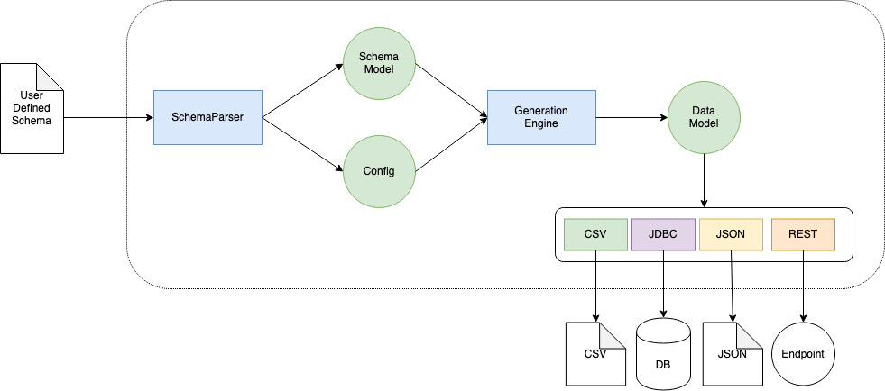

# Chromosoma
Just define your data DNA and generate your dataset.

#### High Level Overview


#### Input
Users just need to define the schema model configuration in a json file. For each field of the schema a name, a type and a set of rules need to be defined.

It follows an example of `schema.json definition:

```json
{
   "instances": 10,

   "output": "result",

   "format": "csv",

   "fields":[
      {
         "name":"name",
         "dataType":"string",
         "rules":[
            {
                "type": "set",
                "values": ["dave","simon"],
                "distribution": 1.0
            }
         ]
      },
      {
         "name":"age",
         "dataType":"int",
         "rules":[
            {
               "type":"set",
               "values":[
                  100
               ],
               "distribution":0.1
            },
            {
               "type":"range",
               "min":10,
               "max":99,
               "distribution":0.9
            }
         ]
      },
      {
         "name":"budget",
         "dataType":"decimal",
         "rules":[
            {
               "type":"set",
               "values":[
                  100
               ],
               "distribution":0.5
            },
            {
               "type":"range",
               "min":1,
               "max":10,
               "distribution":0.5
            }
         ]
      },
      {
         "name":"married",
         "dataType":"boolean",
         "rules":[
            {
               "type":"boolean",
               "false":0.0,
               "true":1.0
            }
         ]
      }
   ]
}
````

#### Output
result.csv
```
dave,64,1.3272667719937015,true
dave,66,100.0,true
simon,16,7.887171701724464,true
simon,100,100.0,true
dave,50,4.378826132850798,true
simon,48,100.0,true
simon,24,1.2484780989173947,true
simon,100,100.0,true
dave,37,100.0,true
dave,48,100.0,true
simon,81,9.032302178134143,true
```

---

## Supported Field Types
- string
- int
- Decimal
- boolean
- date (TODO)

---

## Rules
Every field comes with a set of rules, and every rule comes with a distribution. The distribution you define is used within the generation engine to understand how to distribute your model your data. The sum of the rule distributions for a single rule should be equals to 1.

#### Supported string rules
- String set: the string to be generated is selected randomly from `values`
```json
{
  "name": "first name",
  "dataType": "string",
  "rules": [
      {
        "type": "set",
        "values": ["dave","simon"],
        "distribution": 1.0
      }
    ]
}
```
In the example above, all the first names will be equals to `dave` or `simon`.

#### Supported int rules
- Integer set: the integer to be generated is selected randomly from `values`
- Range: the integer to be generated is selected randomly between min and max
```json
{
     "name":"age",
     "dataType":"int",
     "rules":[
        {
           "type":"set",
           "values":[
              100
           ],
           "distribution":0.1
        },
        {
           "type":"range",
           "min":10,
           "max":99,
           "distribution":0.9
        }
     ]
}
```

In the example above, ~10% of your ages will be equals to 100 and ~90% of your ages will be between 10 and 99.

#### Supported decimal rules
Same as integer rules

#### Supported boolean rules
- Boolean: just define the false and true value distributions
```json
{
     "name":"married",
     "dataType":"boolean",
     "rules":[
        {
           "type":"boolean",
           "false":0.0,
           "true":1.0
        }
     ]
}
```
In the example above, all the `married` rows will be equals to `false`

## Supported Output Format
- CSV (with `,` separator)
- AVRO 
- JSON (TODO)
- JDBC (TODO)
- REST (TODO)

---

## Generation Engine Modeling


---

#### How to run
The only supported mode is standalone. More interactive ways to run to applicative will be developed soon.
```bash
git clone https://github.com/holydrinker/chromosoma.git
cd chromosoma
sbt assembly
java -jar chromosoma-assembly-0.1.0.jar <path-to-schema>.json
```